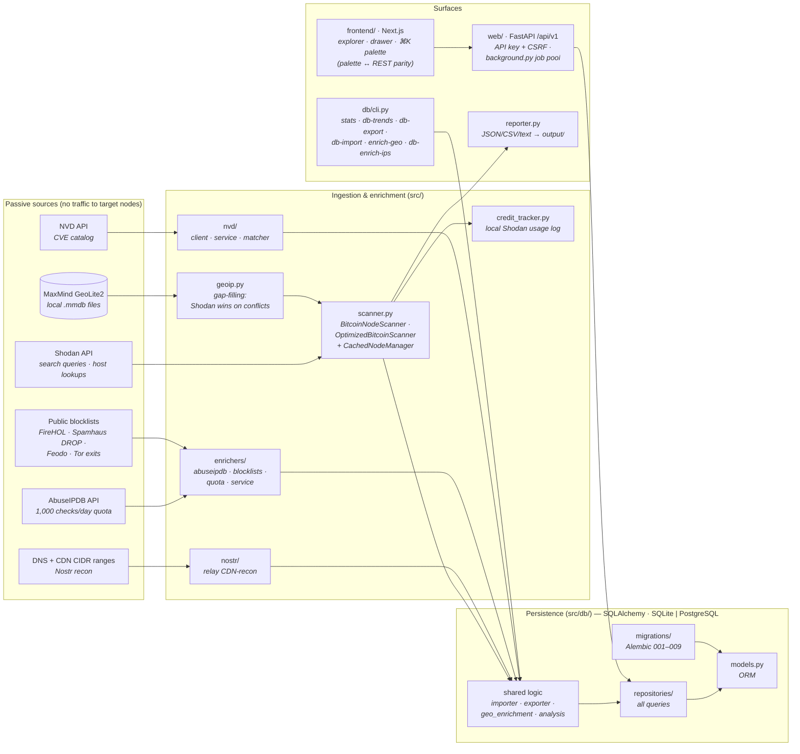
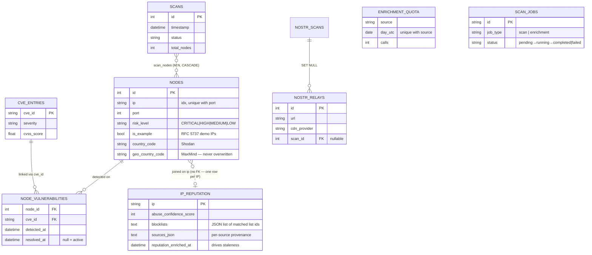

# Architecture Diagrams

How the pieces of the HackNodes Recon Platform relate. Both diagrams render on
GitHub (Mermaid). Companion to `docs/ARCHITECTURE.md` (system map and
lifecycle walkthroughs) — this file focuses on the data-flow and entity
relations.

## Data flow

All recon is **passive**: data comes from third-party databases and public
lists; the platform never sends traffic to the nodes it tracks.

Key flows:

- **Bitcoin scan** — `scanner.py` queries Shodan (search queries, or `--ips`
  host lookups which cost no credits), enriches with MaxMind geo gaps, writes
  JSON dumps via `reporter.py` and/or persists through
  `db/scanner_integration.py`. Credit usage is tracked locally.
- **Reputation enrichment** — `enrichers/` runs per-IP AbuseIPDB lookups under
  a DB-persisted daily quota, plus local blocklist matching; results land in
  `ip_reputation` (one row per IP, shared by all node rows with that IP).
- **NVD correlation** — `nvd/` refreshes the CVE catalog and rebuilds
  `node_vulnerabilities` links (`db-link-cves`).
- **Serving** — the FastAPI layer (`web/`) exposes the data; long-running work
  (scans, enrichment, geo backfill) runs as `ScanJob`s in
  `web/background.py`'s thread pool, with per-`job_type` single-flight. The
  Next.js dashboard consumes the API; every palette command maps 1:1 to a REST
  endpoint (DESIGN.md D10).
- **CLI** — `src/db/cli.py` shares the same persistence logic
  (`db/importer.py`, `db/exporter.py`, `db/geo_enrichment.py`,
  `db/analysis.py`) as the web layer, so both surfaces behave identically.

## Data model

Notes:

- `ip_reputation` has **no foreign key** to `nodes` on purpose: reputation
  outlives node-row churn, and the join column (`nodes.ip`) is not unique.
- `enrichment_quota` persists per-source daily call counts so CLI and API runs
  share one budget across restarts.
- `scan_jobs.job_type` lets an enrichment batch run concurrently with a scan,
  but never two jobs of the same type.
- The Nostr domain (`nostr_scans`, `nostr_relays`) is a second recon domain
  sharing the same persistence, API and dashboard.
