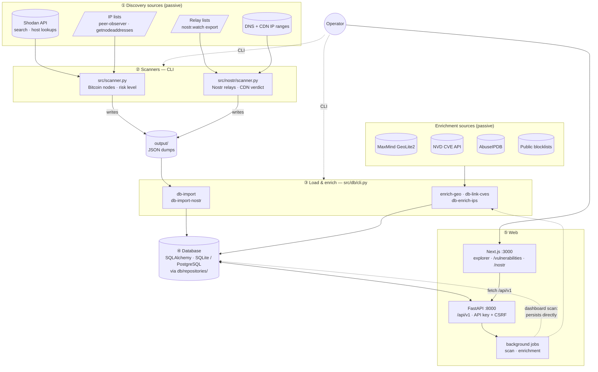
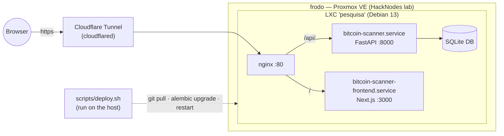
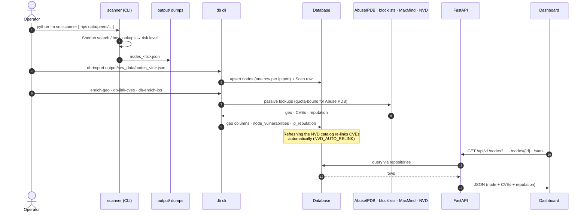
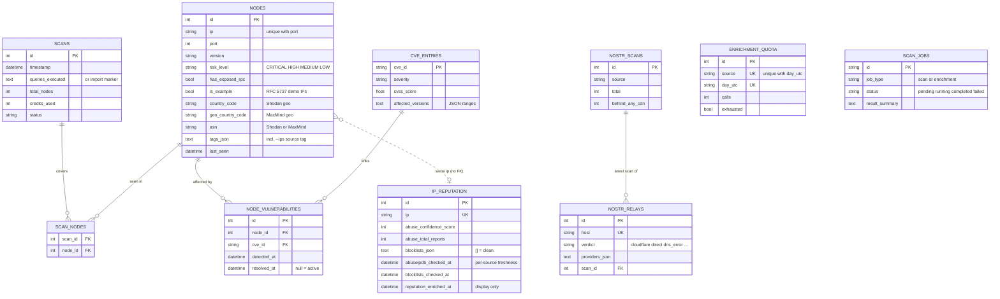

# Architecture

How the pieces of the HackNodes Recon Platform relate: where data comes from,
which tool turns it into what, where it is stored, and how it reaches the
dashboard. The diagrams are [Mermaid](https://mermaid.js.org/) and render on
GitHub.

- [1. System map](#1-system-map)
- [2. Data lifecycle](#2-data-lifecycle)
- [3. Data model](#3-data-model)
- [4. Dashboard ↔ API ↔ tables](#4-dashboard--api--tables)
- [5. Ground rules the design enforces](#5-ground-rules-the-design-enforces)

---

## 1. System map

Every external source is **passive**: third-party databases, public lists or
DNS. Nothing is ever sent to the nodes or relays themselves.

**Reading the map**

- **Two recon domains share one platform.** Bitcoin nodes (Shodan) and Nostr
  relays (DNS + CDN ranges) have separate scanners and separate tables, but the
  same persistence layer, API and dashboard.
- **Scanners never write to the database.** A CLI scan writes a JSON dump to
  `output/`; `db-import` / `db-import-nostr` load it. The one exception is a scan
  started from the dashboard (`POST /api/v1/scans`), which runs in a background
  job and persists directly.
- **Enrichment is a separate, explicit step.** Geo (MaxMind), CVE links (NVD) and
  IP reputation (AbuseIPDB + blocklists) are added after import, by CLI commands
  or background jobs, never as a side effect of scanning.
- **Two processes.** FastAPI serves only JSON under `/api/v1`; the Next.js app is
  the UI. In production nginx puts both behind one origin (see §1.1).

### 1.1 Production topology

Deploys run on the host with `scripts/deploy.sh` (GitHub Actions can't reach the
LAN). Details: [deploy-frodo.md](deploy-frodo.md).

---

## 2. Data lifecycle

From a scan to what the dashboard shows. Each arrow is a command the operator
runs (or a dashboard action); nothing chains automatically except the NVD
re-link noted below.

The Nostr side follows the same shape with its own commands:
`src.nostr.scanner data/relays.txt` → `output/nostr_relays_<ts>.json` →
`db-import-nostr` → `nostr_scans` / `nostr_relays` → `GET /api/v1/nostr/*`.

---

## 3. Data model

Solid lines are foreign keys. The two dashed relations are **logical joins on
the IP string**, deliberately without a foreign key (see notes).

**Notes**

- **`nodes` is keyed by `(ip, port)`**, so one host can have several rows (P2P
  `8333`, RPC `8332`, …). Everything that is a property of the *host* rather than
  the service lives elsewhere, keyed by IP — hence `ip_reputation` is joined on
  `nodes.ip` instead of adding columns to `nodes`.
- **Two geo sources are kept apart on purpose:** Shodan's (`country_code`,
  `city`) and MaxMind's (`geo_country_code`, `geo_country_name`). The drawer shows
  both and flags when they disagree.
- **Per-source freshness:** each enrichment source has its own
  `<source>_checked_at`, so a cheap source (blocklists) never marks an IP as done
  for a quota-bound one (AbuseIPDB).
- **`scan_jobs`** has a unique partial index on `job_type` for `pending`/`running`
  rows: at most one active scan and one active enrichment at a time.
- **`enrichment_quota`** persists AbuseIPDB's daily budget so CLI and API runs
  share it and it survives restarts.
- **Nostr tables are independent** of the Bitcoin ones; a relay is keyed by host.

---

## 4. Dashboard ↔ API ↔ tables

| Dashboard | Endpoint(s) | Tables read / written |
|---|---|---|
| Explorer — node table, query bar, palette filters | `GET /api/v1/nodes` (`risk_level`, `country`, `exposed`, `tor`, `is_example`, `port`, `ip`, `blocklisted`, `blocklist`, `abuse_min`, `reported`) | `nodes`, `node_vulnerabilities`, `ip_reputation` |
| Explorer — stats strip | `GET /api/v1/stats` | `nodes`, `scans` |
| Node drawer (ports, CVEs, host, reputation) | `GET /api/v1/nodes/{id}`, `GET /api/v1/nodes/{id}/geo` | `nodes`, `node_vulnerabilities`, `cve_entries`, `ip_reputation` |
| Palette `scan: start` | `POST /api/v1/scans`, `GET /api/v1/scans/{job_id}` | `scan_jobs` → `nodes`, `scans` |
| (API only) reputation batch | `POST /api/v1/enrichment/run`, `GET /api/v1/scans/{job_id}` | `scan_jobs`, `ip_reputation`, `enrichment_quota` |
| `/vulnerabilities` | `GET /api/v1/vulnerabilities`, `GET /api/v1/vulnerabilities/{cve_id}/nodes` | `cve_entries`, `node_vulnerabilities`, `nodes` |
| `/nostr` | `GET /api/v1/nostr/relays`, `GET /api/v1/nostr/stats` | `nostr_scans`, `nostr_relays` |
| Every mutating call | `GET /api/v1/csrf-token` | — |

Full endpoint reference: [API.md](API.md).

---

## 5. Ground rules the design enforces

| Rule | Where it lives |
|---|---|
| **Passive only** — no traffic to nodes or relays | All sources are third-party APIs, downloaded lists or DNS |
| **Shodan credit safety** — cache, capped pages per scan, credit-free host lookups for `--ips` | `OptimizedBitcoinScanner`, `CachedNodeManager`, `MAX_QUERY_CREDITS_PER_SCAN` |
| **Quota safety** for paid-tier-like APIs | `src/enrichers/quota.py` (`enrichment_quota`) |
| **Example data never pollutes analytics** — RFC 5737 IPs flagged and never enriched | `src/example_ips.py`, `nodes.is_example` |
| **CLI paths confined** — command-line file paths must resolve under `INPUT_DIR` (`data/`) or `OUTPUT_DIR` (`output/`) | `src/safe_paths.py` |
| **Auth on every API call** — API key, plus CSRF on mutations | `src/web/auth.py` |
| **Specs first** — behaviour is specified per capability | `openspec/specs/` |
